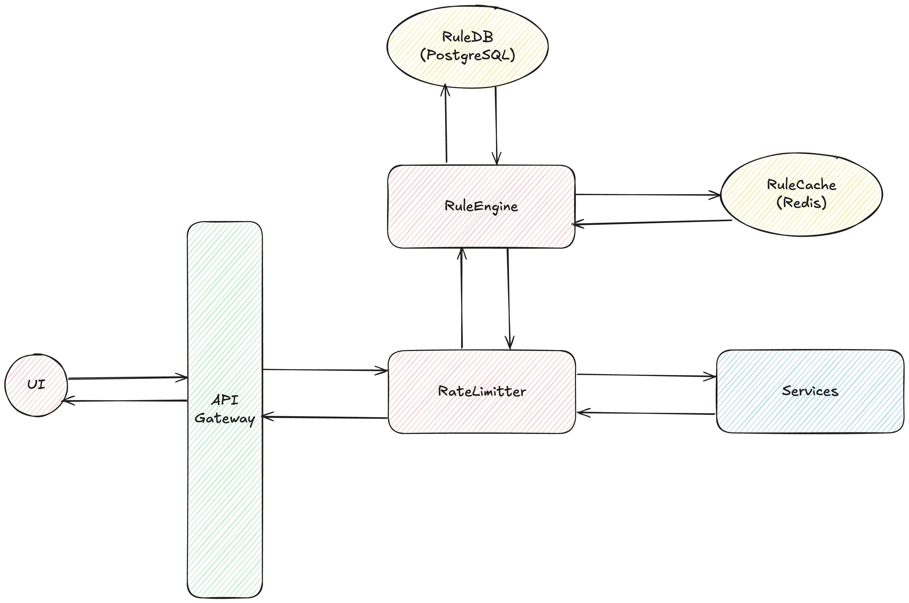

# Advanced Rate Limiter with CQRS and Rule Engine

## Overview

This is a sophisticated rate limiting system built using **CQRS (Command Query Responsibility Segregation)** architecture with an integrated **Rule Engine**. The system provides flexible, configurable rate limiting capabilities with advanced rule-based decision making for controlling and preventing frequent and suspected requests.

## Architecture

### CQRS Architecture
The system implements CQRS pattern with clear separation between:
- **Command Side**: Handles write operations (applying rate limits, creating rules)
- **Query Side**: Handles read operations (checking status, getting statistics)
- **Event Sourcing**: All state changes are captured as events
- **Read Models**: Optimized projections for fast queries

### Component Diagram


## Key Features

### 🚀 Rate Limiting
- **Multiple Algorithms**: Token Bucket, Sliding Window, Fixed Window, Leaky Bucket
- **Flexible Configuration**: Per-resource, per-client rate limiting
- **Dynamic Rules**: Rules can be created and modified at runtime
- **Event-Driven**: All rate limit changes generate events

### 🛡️ Rule Engine
- **Flexible Conditions**: Support for complex rule conditions
- **Multiple Actions**: Allow, deny, throttle, rate limit actions
- **Priority-Based**: Rules are evaluated based on priority
- **Rule Types**: Rate limiting, blacklist, whitelist, geofence, time-based rules

### 📊 Monitoring & Analytics
- **Real-time Status**: Current rate limit status for any client/resource
- **Historical Data**: Complete history of rate limit events
- **Statistics**: Client statistics with time-series data
- **Event Streaming**: Real-time event notifications

## System Components

### Rate Limiter Module (`rate-limiter/`)

#### Domain Layer
- **Events**: `RateLimitRequestedEvent`, `RateLimitAppliedEvent`, `RateLimitExceededEvent`
- **Aggregates**: `RateLimitAggregate` with business logic
- **Rules**: Rate limiting rule definitions

#### CQRS Layer
- **Commands**: `ApplyRateLimitCommand`, `CreateRuleCommand`, `ResetRateLimitCommand`
- **Queries**: `GetRateLimitStatusQuery`, `GetRateLimitHistoryQuery`, `GetClientStatsQuery`
- **Handlers**: Separate command and query handlers

#### Infrastructure Layer
- **Event Store**: In-memory and Redis implementations
- **Read Models**: Optimized for query performance
- **Repositories**: Rule and event storage

### Rule Engine Module (`rule-engine/`)

#### Domain Layer
- **Rules**: Complex rule definitions with conditions and actions
- **Evaluation**: Rule evaluation engine with multiple operators
- **Context**: Rich evaluation context with metadata

#### Engine Layer
- **Rule Engine**: Central rule evaluation service
- **Repository**: Rule storage and retrieval
- **Event Publisher**: Rule evaluation event publishing

## API Endpoints

### Rate Limiting
- `POST /api/v1/ratelimit/check` - Check and apply rate limit
- `GET /api/v1/ratelimit/status` - Get current rate limit status
- `GET /api/v1/ratelimit/history` - Get rate limit history
- `GET /api/v1/ratelimit/stats` - Get client statistics
- `POST /api/v1/ratelimit/rules` - Create rate limit rule
- `POST /api/v1/ratelimit/reset` - Reset rate limit

### Integrated Service
- `POST /api/v1/check` - Integrated request check (rules + rate limiting)
- `POST /api/v1/security/block-ips` - Block IP addresses
- `POST /api/v1/security/rate-limit-resources` - Apply resource-based rate limiting

## Quick Start

### 1. Start the Full Stack with Docker (Recommended)
```bash
# Start everything with one command
make stack-up

# Or manually with docker-compose
docker-compose up -d
```

This will start:
- **Rate Limiter Service** on port 8080
- **Integrated Service** on port 8081
- **Load Balancer (Nginx)** on port 80
- **PostgreSQL** database on port 5432
- **Redis** cache on port 6379
- **Grafana** monitoring on port 3000
- **Prometheus** metrics on port 9090
- **Kibana** logs on port 5601
- **Jaeger** tracing on port 16686
- **Admin UI** on port 3001

### 2. Run Individual Services (Development)
```bash
# Basic rate limiter only
make run-basic

# Integrated service with rule engine
make run-integrated

# Example client
make run-client
```

### 3. Test with Load Testing
```bash
# Run load tests
make test-load

# Or manually
docker-compose --profile testing up test-client
```

## Docker Architecture

### Services Overview

| Service | Port | Description |
|---------|------|-------------|
| rate-limiter-service | 8080 | Basic CQRS rate limiter |
| integrated-service | 8081 | Rate limiter + rule engine |
| nginx | 80, 443 | Load balancer & reverse proxy |
| postgres | 5432 | Primary database (rules, events) |
| redis | 6379 | Event store & caching |
| grafana | 3000 | Metrics dashboard |
| prometheus | 9090 | Metrics collection |
| elasticsearch | 9200 | Log aggregation |
| kibana | 5601 | Log visualization |
| jaeger | 16686 | Distributed tracing |
| swagger-ui | 8081/swagger/ | API documentation & testing |

### Docker Commands

```bash
# Full stack management
make stack-up          # Start everything
make stack-down        # Stop everything
make stack-restart     # Restart everything
make stack-status      # Show status

# Network management (if you get network conflicts)
make network-clean     # Clean up Docker networks
make network-check     # Check for conflicts

# Individual operations
make docker-build      # Build all images
make docker-run        # Start with compose
make docker-stop       # Stop services
make docker-clean      # Clean everything

# Monitoring
make monitor-logs      # View service logs
make monitor-metrics   # Open Grafana
make monitor-traces    # Open Jaeger

# Testing
make test-load         # Load testing
make test-integration  # Integration tests
```

### Troubleshooting

#### Network Conflicts
If you encounter network conflicts like "Pool overlaps with other one":

```bash
# Clean up networks
make network-clean

# Check for conflicts
make network-check

# Force cleanup if needed
docker system prune -a
```

#### Service Not Starting
```bash
# Check service status
docker-compose ps

# View logs
docker-compose logs [service-name]

# Restart individual service
docker-compose restart [service-name]
```

#### Database Issues
```bash
# Reset database
docker-compose down -v
docker-compose up -d postgres

# Check database logs
docker-compose logs postgres
```

## Usage Examples

### Basic Rate Limit Check
```json
POST /api/v1/ratelimit/check
{
  "client_id": "user123",
  "resource": "api",
  "ip_address": "192.168.1.100",
  "user_agent": "MyApp/1.0"
}
```

Response:
```json
{
  "client_id": "user123",
  "resource": "api",
  "is_allowed": true,
  "request_count": 1,
  "limit": 100,
  "remaining_quota": 99,
  "window_start": "2025-08-03T10:00:00Z",
  "window_end": "2025-08-03T11:00:00Z",
  "reset_time": "2025-08-03T11:00:00Z",
  "is_blocked": false
}
```

### Integrated Request Check (Rules + Rate Limiting)
```json
POST /api/v1/check
{
  "client_id": "user123",
  "resource": "login",
  "ip_address": "192.168.1.100",
  "user_agent": "Chrome/91.0",
  "metadata": {
    "country": "US",
    "device": "mobile"
  },
  "request_data": {
    "username": "john.doe",
    "attempt_count": 2
  }
}
```

Response:
```json
{
  "allowed": true,
  "reason": "allowed",
  "rule_results": [
    {
      "rule_id": "whitelist-internal-ips",
      "rule_name": "Whitelist Internal IPs",
      "matched": true,
      "actions": [
        {
          "type": "allow",
          "parameters": {
            "reason": "internal IP"
          }
        }
      ],
      "evaluated_at": "2025-08-03T10:00:00Z"
    }
  ],
  "rate_limit_status": {
    "client_id": "user123",
    "resource": "login",
    "is_allowed": true,
    "request_count": 1,
    "limit": 5,
    "remaining_quota": 4
  }
}
```

### Create Security Rules
```json
POST /api/v1/security/block-ips
{
  "ip_addresses": ["10.0.0.1", "10.0.0.2"],
  "reason": "Malicious activity detected"
}
```

## Configuration Examples

### Rate Limiting Rules
```go
// API rate limit: 100 requests per minute
service.CreateRule(ctx, "api", 100, time.Minute, "sliding_window")

// Login attempts: 5 per 15 minutes
service.CreateRule(ctx, "login", 5, 15*time.Minute, "fixed_window")

// File uploads: 10 per hour
service.CreateRule(ctx, "upload", 10, time.Hour, "sliding_window")
```

### Security Rules
```go
// Block suspicious user agents
rule := domain.Rule{
    Name: "Block Bots",
    Type: domain.BlacklistRule,
    Conditions: []domain.RuleCondition{
        {
            Field:    "user_agent",
            Operator: "contains",
            Value:    "bot",
        },
    },
    Actions: []domain.RuleAction{
        {
            Type: "deny",
            Parameters: map[string]interface{}{
                "reason": "Bot detected",
            },
        },
    },
}
```

## Advanced Features

### Event-Driven Architecture
- All rate limit changes generate events
- Real-time event streaming
- Event sourcing for complete audit trail

### Dynamic Rule Management
- Create rules at runtime
- Priority-based rule evaluation
- Tag-based rule organization

### Scalability
- Separate read/write models
- Event-driven projections
- Stateless service design

### Extensibility
- Plugin architecture for new algorithms
- Custom rule conditions and actions
- Multiple storage backends

## Production Considerations

### Storage
- **Redis**: For high-performance event store
- **PostgreSQL**: For rule repository and read models
- **Event Streaming**: Kafka or RabbitMQ for event publishing

### Monitoring
- **Metrics**: Prometheus integration
- **Logging**: Structured logging with correlation IDs
- **Alerting**: Rate limit threshold alerts

### Security
- **Authentication**: API key or JWT validation
- **Authorization**: Role-based access control
- **Rate Limiting**: Self-protecting API endpoints

## Development

### Project Structure
```
├── rate-limiter/           # Main rate limiter module
│   ├── internal/
│   │   ├── domain/         # Domain entities and events
│   │   ├── commands/       # CQRS commands
│   │   ├── queries/        # CQRS queries
│   │   ├── handlers/       # Command and query handlers
│   │   ├── infrastructure/ # Storage implementations
│   │   ├── api/           # Service and HTTP layers
│   │   └── integration/   # Integration with rule engine
│   ├── cmd/server/        # Basic rate limiter server
│   └── examples/client/   # Example client
├── rule-engine/           # Rule engine module
│   └── internal/
│       ├── domain/        # Rule domain objects
│       ├── engine/        # Rule evaluation engine
│       └── infrastructure/ # Rule storage
├── cmd/integrated-server/ # Integrated server
└── asset/                # Documentation assets
```

### Testing
```bash
# Run tests for rate limiter
cd rate-limiter && go test ./...

# Run tests for rule engine
cd rule-engine && go test ./...

# Integration tests
go test ./cmd/integrated-server/...
```

## Contributing

1. Follow CQRS principles for new features
2. Add comprehensive tests for new functionality
3. Update documentation for API changes
4. Follow Go best practices and conventions
